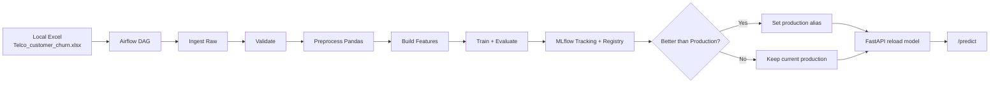

# Customer Churn MLOps - Simplified Architecture (Student Version)

## 1) Overall Architecture

This design is intentionally simple and practical for a student project.

- Batch pipeline only (no streaming).
- Local Excel as source of truth.
- Orchestration by Airflow.
- Experiment tracking and registry by MLflow.
- Online inference by FastAPI.
- Local deployment with Docker Compose.



## 2) End-to-End Data Flow

1. Source file lives at `data-pipeline/data/Newdata/Telco_customer_churn.xlsx`.
2. Airflow checks whether file changed (`md5`).
3. Changed file is copied to raw zone.
4. Validation checks schema and basic quality.
5. Preprocessing creates cleaned CSV.
6. Feature step creates train-ready dataset.
7. Training script tests Logistic Regression and Random Forest.
8. Best run is logged to MLflow.
9. Evaluation gate checks threshold.
10. Register candidate model and compare with current production score.
11. If better, update alias `production`.
12. FastAPI reloads `models:/churn_prediction_model@production`.

## 3) What To Remove From Current Project

Remove from active architecture for this student scope:

- Kafka stack (`infra/docker/kafka`, `infra/k8s/kafka`)
- MinIO integration (`infra/docker/mlflow` old compose with MinIO)
- Kubernetes manifests (`infra/k8s/*`)
- Spark usage (none needed, keep pure pandas)
- Over-advanced monitoring stack if not needed for demo (`infra/docker/monitor` optional)

Keep these as archive if you still want references, but do not run them in demo.

## 4) Mapping From Existing Structure

### Keep

- `data-pipeline/`
- `model_pipeline/`
- `serving_pipeline/`
- `infra/docker/`

### Refactor/Use New

- New simplified infra under `infra/docker/student/`
- New simple scripts in `data-pipeline/scripts/`
- New simple training scripts in `model_pipeline/src/scripts/`
- New simple serving app in `serving_pipeline/simple_api/`

### Suggested Lean Tree

```text
aio2025-mlops-project01-main/
  data-pipeline/
    data/
      Newdata/
      raw/
      processed/
    scripts/
      simple_ingest.py
      simple_validate.py
      simple_preprocess.py
      simple_build_features.py
  model_pipeline/
    src/
      scripts/
        simple_train.py
        simple_evaluate.py
        simple_register_rollout.py
      artifacts/
  serving_pipeline/
    simple_api/
      app.py
      Dockerfile
      requirements.txt
  infra/
    docker/
      student/
        docker-compose.yml
        dags/churn_batch_pipeline.py
        airflow/
        postgres-init/
```

## 5) Airflow DAG Design

DAG id: `churn_batch_pipeline`

Tasks and IO:

1. `check_new_data` (ShortCircuitOperator)
   - Input: source Excel + last ingest state.
   - Output: bool changed/not changed.
2. `ingest_raw_data` (BashOperator)
   - Input: source Excel.
   - Output: raw Excel + `_ingest_state.json`.
3. `validate_data` (BashOperator)
   - Input: raw Excel.
   - Output: pass/fail validation.
4. `preprocess_data` (BashOperator)
   - Input: raw Excel.
   - Output: `churn_processed.csv`.
5. `build_features` (BashOperator)
   - Input: processed CSV.
   - Output: `churn_features.csv`.
6. `train_model` (BashOperator)
   - Input: feature CSV.
   - Output: MLflow runs + `latest_run.json` + `latest_metrics.json`.
7. `evaluate_model` (BashOperator)
   - Input: `latest_metrics.json`.
   - Output: `eval_gate.json` (pass/fail).
8. `register_model` (BashOperator)
   - Input: latest run + eval gate.
   - Output: MLflow model version + alias update if better.
9. `deploy_model` (PythonOperator)
   - Input: `deploy_status.json`.
   - Output: call FastAPI `/reload-model` if rolled out.
10. `notify_status` (PythonOperator)
   - Input: deploy status.
   - Output: final summary logs.

Dependencies:

`check_new_data -> ingest_raw_data -> validate_data -> preprocess_data -> build_features -> train_model -> evaluate_model -> register_model -> deploy_model -> notify_status`

Trigger strategy:

- Schedule: every 6 hours (`0 */6 * * *`)
- Manual trigger for demo in Airflow UI.

## 6) MLflow + Registry Design

- Experiment: `churn_simple_experiment`.
- Candidate runs: one run per model family.
- Logged items:
  - params (dataset path, target)
  - metrics (`val_accuracy`, `val_precision`, `val_recall`, `val_f1`, `val_roc_auc`)
  - model artifact (`model`)
- Registry model: `churn_prediction_model`.
- Production pointer: alias `production`.
- Rollout rule:
  - if candidate `val_roc_auc` > current production `val_roc_auc`, update alias.

## 7) FastAPI Design

Endpoints:

- `GET /health`
- `POST /predict`
- `POST /reload-model`

Request body for `/predict`:

```json
{
  "Age": 30,
  "Gender": "Female",
  "Tenure": 39,
  "Usage_Frequency": 14,
  "Support_Calls": 5,
  "Payment_Delay": 18,
  "Subscription_Type": "Standard",
  "Contract_Length": "Annual",
  "Total_Spend": 932.0,
  "Last_Interaction": 17
}
```

Response:

```json
{
  "churn_prediction": 1,
  "churn_probability": 0.81,
  "model_uri": "models:/churn_prediction_model@production"
}
```

## 8) Docker Compose (Minimal)

`infra/docker/student/docker-compose.yml` runs:

- postgres
- mlflow
- airflow-init
- airflow-webserver
- airflow-scheduler
- fastapi

Notes:

- One shared network by compose default.
- Source code mounted into Airflow containers at `/opt/project`.
- MLflow and Postgres data persisted via named volumes.

## 9) Basic Monitoring Strategy

- Airflow task logs for pipeline monitoring.
- MLflow for training/evaluation history.
- FastAPI app logs and JSONL inference logs (`/app/logs/inference_log.jsonl`).
- No heavy observability stack required.

## 10) Keep Feast or Remove Feast?

Best for this project: **Remove Feast for now**.

Why:

- Batch churn use case does not require low-latency online feature store.
- Feast adds conceptual and operational overhead.
- Simpler file-based feature pipeline is easier for demo and report.

Alternative if you must keep Feast:

- Keep Feast only as offline feature registry and document it as optional extension.
- Do not integrate online store in this phase.

## 11) Refactor Roadmap

1. Run only `infra/docker/student` stack.
2. Demo pipeline with local Excel source.
3. Validate model rollout with MLflow alias.
4. Demo API predict + reload.
5. Archive old infra paths in report appendix.

## 12) Reporting/Slide Guidance

Use this structure:

- Problem statement: churn prediction for retention.
- Constraints: student scope, local deployment.
- New architecture: batch + Docker Compose.
- Pipeline stages with DAG screenshot.
- Metrics and model selection in MLflow screenshot.
- API serving and sample prediction.
- Rationale for removing Kafka/MinIO/Spark/K8s:
  - lower complexity
  - faster implementation
  - easier reproducibility
  - still covers core MLOps lifecycle
