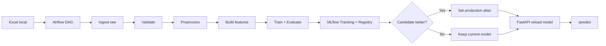

# Customer Churn Prediction

## 1. Project Goal

Bài toán dự đoán khách hàng rời bỏ (Customer Churn Prediction).

- Dữ liệu đầu vào: file Excel local.
- Orchestration: Airflow.
- Experiment tracking + Model Registry: MLflow.
- Serving: FastAPI.
- Hạ tầng: Docker Compose.

## 2. Data Source

Nguồn dữ liệu chính:
- data-pipeline/data/Newdata/Telco_customer_churn.xlsx

Pipeline đọc trực tiếp file này và chạy theo batch.

## 3. Simplified Architecture



## 4. UI Endpoints and Accounts

### Airflow UI
- URL: http://localhost:8080
- Username: airflow
- Password: airflow

### MLflow UI
- URL: http://localhost:5000
- Auth: không bật (local demo)

### FastAPI Docs
- URL: http://localhost:8000/docs
- Auth: không bật (local demo)

## 5. Run Project (Already Verified)

```bash
cd infra/docker/student
docker compose up --build -d
```

Kiểm tra nhanh:

```bash
# FastAPI health
curl http://localhost:8000/health

# Airflow health (PowerShell nên dùng Invoke-RestMethod)
# MLflow UI
open http://localhost:5000
```

## 6. Airflow Workflow (DAG)

DAG: churn_batch_pipeline

Task flow:
1. check_new_data
2. ingest_raw_data
3. validate_data
4. preprocess_data
5. build_features
6. train_model
7. evaluate_model
8. register_model
9. deploy_model
10. notify_status

Output chính:
- Raw: data-pipeline/data/raw/telco_customer_churn.xlsx
- Processed: data-pipeline/data/processed/churn_processed.csv
- Features: data-pipeline/data/processed/churn_features.csv
- Artifacts summary:
  - model_pipeline/src/artifacts/latest_run.json
  - model_pipeline/src/artifacts/latest_metrics.json
  - model_pipeline/src/artifacts/eval_gate.json
  - model_pipeline/src/artifacts/deploy_status.json

## 7. FastAPI Endpoints

### GET /health
Kiểm tra trạng thái API + model đã load hay chưa.

### POST /predict
Dự đoán churn cho 1 khách hàng.

Ví dụ request:

```json
{
  "Age": 30,
  "Gender": "Female",
  "Tenure": 39,
  "Usage_Frequency": 14,
  "Support_Calls": 5,
  "Payment_Delay": 18,
  "Subscription_Type": "DSL",
  "Contract_Length": "Month-to-month",
  "Total_Spend": 932.0,
  "Last_Interaction": 17
}
```

### POST /reload-model
Buộc API reload model production từ MLflow Registry.

## 8. Cleaned Source Layout

Đã dọn khu script trong model_pipeline/src/scripts:
- Script đang dùng:
  - simple_train.py
  - simple_evaluate.py
  - simple_register_rollout.py
- Script cũ đã chuyển sang:
  - model_pipeline/src/scripts/legacy/

Mục tiêu: giảm nhiễu, chỉ giữ entrypoint cần cho demo.

## 9. Workflow

1. Bài toán churn prediction và ý nghĩa nghiệp vụ.
2. Ràng buộc đồ án: local deployment, không over-engineering.
3. Kiến trúc hệ thống tối giản (Docker Compose + Airflow + MLflow + FastAPI).
4. Luồng dữ liệu từ Excel local đến model production.
5. Airflow DAG orchestration toàn bộ quy trình.
6. Theo dõi thực nghiệm và quản lý version bằng MLflow.
7. Serving online bằng FastAPI, demo predict thực tế.
8. Kết luận: loại bỏ Kafka/MinIO/Spark/K8s giúp hệ thống dễ triển khai, dễ bảo trì, vẫn đủ vòng đời MLOps.
